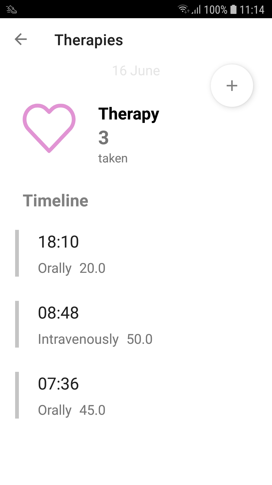
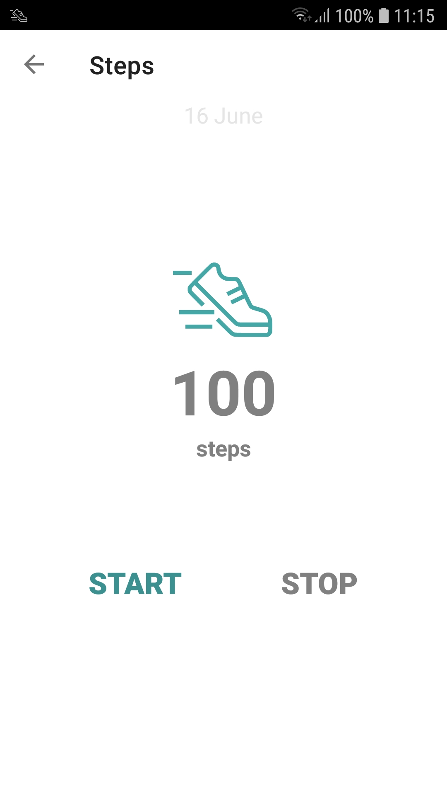
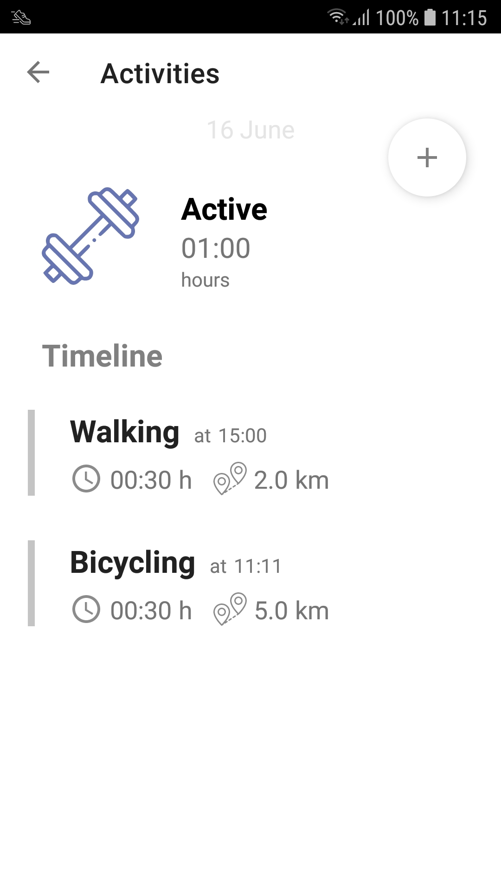
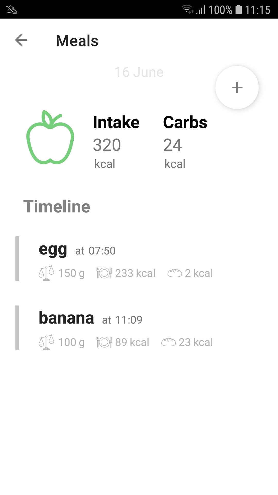
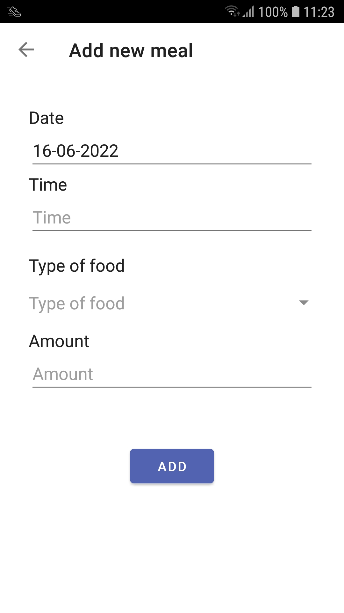

Diatra
--------------

Mobile application to support diabetics track their therapies, eating habits and physical activity.

Architecture Components
--------------

* [LiveData][13] - Build data objects that notify views when the underlying database changes.
* [Navigation][14] - Handle everything needed for in-app navigation.
* [Room][16] - Access app's SQLite database with in-app objects and compile-time checks.
* [ViewModel][17] - Store UI-related data that isn't destroyed on app rotations. Easily schedule
  asynchronous tasks for optimal execution.
* [Fragment][34] - A basic unit of composable UI.

[13]: https://developer.android.com/topic/libraries/architecture/livedata
[14]: https://developer.android.com/topic/libraries/architecture/navigation/
[16]: https://developer.android.com/topic/libraries/architecture/room
[17]: https://developer.android.com/topic/libraries/architecture/viewmodel
[34]: https://developer.android.com/guide/components/fragments

Screenshots
--------------

</img>
</img>
</img>

</img>
</img>
</img>